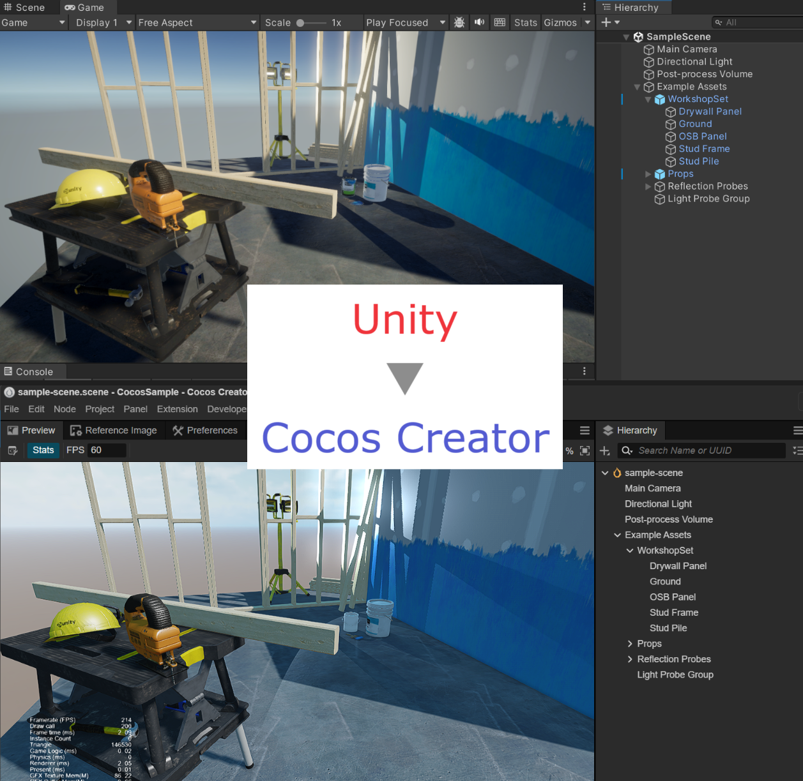

# Unity 2 Cocos



Export 3D scenes and assets created in Unity to CocosCreator.

## Feature

Re-export 3D scenes and assets created in Unity as Cocos files.

- From Unity's left-hand scene to Cocos' right-hand scene.
- Image, FBX meshes copy and auto-generate meta files.
- Support URP material to Cocos material convert. ( If you are using Built-In pipeline, you can convert to URP with the Unity's support. )
- Map Unity's Built-In assets to Cocos' Built-In assets. (ex. Unity's Cube mesh -> Cocos' Box mesh)
- Format directory paths to be web-like.

## Under development

- Support more material property convert.
- Support more 3D feature. (LOD Group / Reflection Probe / Collider / Rigidbody etc)
- TypeScript only generate and set property. (logic is empty)

## ⚠️ Caution ⚠️
This is an experimental project. Complete conversion is not possible.  
Make a backup of your project if you use it.

The following will not be supported.

- ParticleSystem / 2D Feature / uGUI convert.
- Prefab / Audio / Animation export.

## Install

To install via upm, specify `https://github.com/ina-amagami/Cocos2Unity.git?path=Packages/Unity2Cocos`.

```manifest.json
{
  "dependencies": {
    "jp.amagamina.unity-2-cocos": "https://github.com/ina-amagami/Unity2Cocos.git?path=Packages/Unity2Cocos",
  }
}
```

## Setup: WIP

## Verified

- Unity 2022.3.11f1 / URP 14.0.9
- Cocos Creator 3.8

## Package License

This software is released under the MIT License.
https://opensource.org/licenses/mit-license.php

Copyright (c) 2023 ina-amagami / Amagamina Games, Inc. (ina@amagamina.jp)

The UniversalRenderPipeline sample scenes included in the repository were created by Unity Software Inc.
