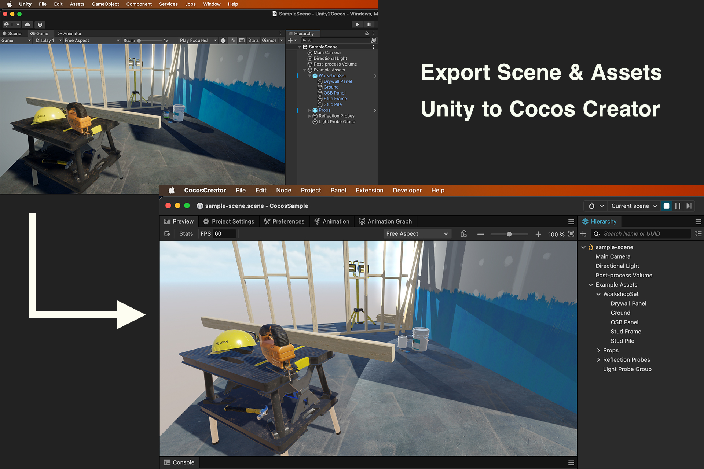
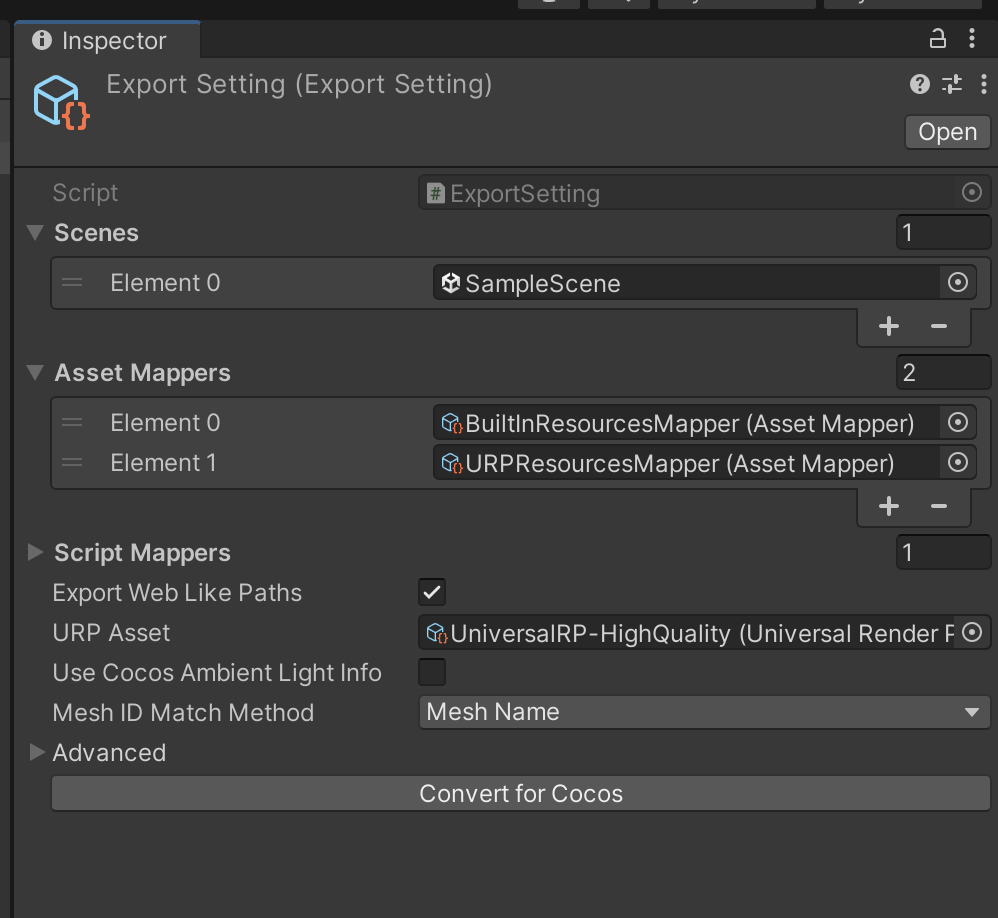
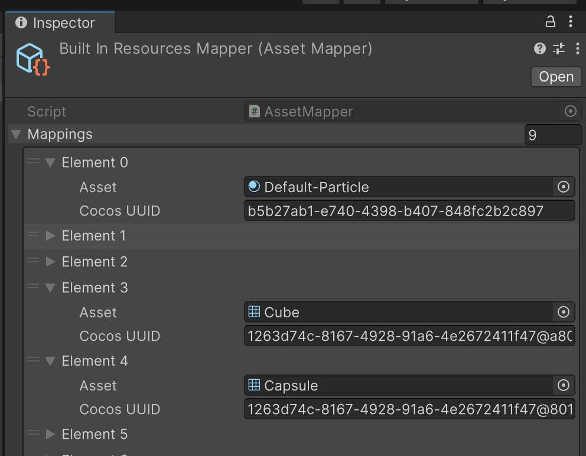
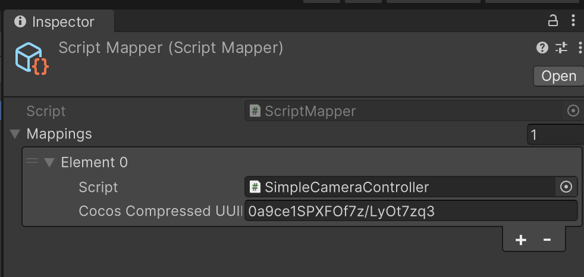

# Unity 2 Cocos



Export 3D scene and assets in Unity to Cocos Creator.

## Demo

Unity URP sample scene converted for Cocos and built on the web.

[https://amagamina.jp/unity-2-cocos-demo/](https://amagamina.jp/unity-2-cocos-demo/)

## Feature

- From Unity's left-hand scene to Cocos' right-hand scene.

- Image, FBX meshes copy and auto-generate meta files.

- Support URP material to Cocos material convert. ( If you are using Built-In pipeline, you can convert to URP with the Unity's support. )

- Map Unity's assets to Cocos' assets. (ex. Unity's Cube mesh -> Cocos' Box mesh)

## Under development

- Support 3D physics feature. (Collider / Rigidbody etc)

## ⚠️ Caution ⚠️
This is an experimental project. Complete conversion is not possible.  
Make a backup of your project if you use it.

The following will not be supported. We need your help!

- Prefab support. (Very complicated...)

- ParticleSystem / 2D Feature / uGUI convert.

- Audio / Animation export.

If you are new to CocosCreator, please read this page first to understand the differences between Unity and CocosCreator. 
https://docs.cocos.com/creator/manual/en/guide/unity/

## Required

\>= Unity 2022.3.11f1 ( \>= URP 14.0.9 )

\>= Cocos Creator 3.8.0

## Install

To install via upm, specify `https://github.com/ina-amagami/Cocos2Unity.git?path=Packages/Unity2Cocos`.

```manifest.json
{
  "dependencies": {
    "jp.amagamina.unity-2-cocos": "https://github.com/ina-amagami/Unity2Cocos.git?path=Packages/Unity2Cocos",
  }
}
```

Or copy `/Packages/Unity2Cocos/` into your project.

Use the `com.unity.nuget.newtonsoft-json >= 3.0.2`

## How to

### 1. Setup

- Create a CocosCreator project.

- If using PostProcessVolume or FXAA, set up a custom Cocos rendering pipeline. please see https://docs.cocos.com/creator/manual/en/render-pipeline/post-process/

- Create a setting file in `Assets/Create` menu select of `Unity2Cocos/ExportSetting` in Unity.

### 2. Configulation



- Add the scene you want to convert to "Scenes" list.

- Change settings as needed (see below "Setting").

### 3. Export

- Click "Convert for Cocos".

- Select export directory (root directory of Cocos project).

### 4. Run Python script

FBX mesh uuid that cannot be identified on Unity is modified by Python scripts after importing into Cocos.

- Run the Python script `Packages/Unity2Cocos/Tools/replace_mesh_id.py`.

```zsh
% python3 ./Packages/Unity2Cocos/Tools/replace_mesh_id.py

Enter the folder path: [Your export directory]
```

- If you see the following, you have succeeded. Open the scene in Cocos and check it.


```zsh
...

- Replace: 929e9c50-5f7a-41ae-93db-7aedb8c94ac4@mesh-name:safety_hat_low.mesh -> 3d871
- Replace: b332724b-ff23-422d-9369-99df2ab5a6ac@mesh-name:level_low.mesh -> 78d63
- Replace: d05f7138-939f-4ab0-a06b-1b7e76e0c6c3@mesh-name:safety_goggles_low.mesh -> c40d4

--- Replace mesh id end ---
```

## Setting

| Title | Description |
| ---- | ---- |
| Asset Mappers | <br>If assets are already prepared on the Cocos side, only references can be set automatically.<br><br>Create a new file in `Assets/Create` menu select of `Unity2Cocos/AssetMapper`.<br><br>Maps the specified asset to a Cocos asset, specified by Cocos UUID. In Cocos, you can right-click on an asset and copy its UUID. |
| Script Mappers | <br>Can be created in the `Unity2Cocos/ScriptMapper` menu.<br>Similar to AssetMapper, it maps custom MonoBehaviour C# scripts used in the scene to TypeScripts already created on the Cocos side.<br><br>Note the use of "Compressed UUID" here.<br>when you copy a UUID in Cocos, you will see the following in the Console.<br>`UUID has been copied: aaf9f561-03d5-4451-967c-0a0feb4c838c , Compressed UUID: aa+fVhA9VEUZZ8Cg/rTIOM`<br><br>In the sample project, the camera control script is replaced with one created on the Cocos side.<br><br>\* Property conversions are not supported. |
| Export Web Like Paths | ex) SampleScene → sample-scene |
| URP Asset | If not specified, the currently used Asset is adopted. |
| Use Cocos Ambient Light Info | Ambient light of Unity and Cocos is very different, turn ON if you want to use the Cocos defaults. |
| Mesh Id Match Method | Since Unity cannot know the UUID assigned to the FBXMesh on the Cocos side, we set up a Python script to search for the UUID when modifying the FBXMesh.<br><br>Mesh Name - Search by mesh name.<br>Triangles - Search by polygon count.<br><br>Choose the one that works best for your project. Note that neither is perfect, so you may need to set up references manually. |
| Advanced/ | (Details omitted.) |

## Support Status

### Scene Information

| Title | Status | Remarks |
| ---- | :---: | ---- |
| Ambient Light | ✅ | Only gradient settings are taken over (because Cocos only supports gradients). |
| Shadows | ✅ | Refer to URP pipeline settings. |
| Skybox | ❌ | |
| Prefab | ❌ | Unpack to a normal GameObject and then convert. |

### Assets

| Title | Status | Remarks |
| ---- | :---: | ---- |
| Scene | ✅ | Unsupported components will be skipped. |
| Prefab | ❌ | |
| FBX Model | ✅ | |
| Single Mesh and<br>non-FBX formats | ❌ | |
| 2D Texture | ✅ | Some formats may not be supported by Cocos. |
| 3D Texture<br>TextureArray | ❌ | |
| Sprite | ❌ | |
| Material  | ✅ | If no MaterialConverter is defined, Cocos' Standard shaders are used. |
| Shader  | ❌ | Use the one prepared on the Cocos side. |

### Components

| Title | Status | Remarks |
| ---- | :---: | ---- |
| Transform | ✅ | Converted from left hand coordinate system to right hand coordinate system. |
| Mesh Filter &<br>MeshRenderer | ✅ | |
| Skinned Mesh Renderer | ❌ | |
| Sprite Renderer | ❌ | |
| Camera | ✅ | Physical parameters are not supported. |
| Light | ✅ | Area light not yet supported (will be in the future). |
| LightProbeGroup | ✅ | |
| LODGroup | ✅ | |
| ReflectionProbe | ✅ | Note that resolution settings are very different between Unity and Cocos. |
| Volume<br>(PostProcessing) | ✅ | Global Volume only, uses Cocos PostProcess. Needs to be configured on Cocos side.<br> https://docs.cocos.com/creator/manual/en/render-pipeline/post-process/<br><br>Supported only by Bloom, FXAA. |
| Colliders | ❌ | Future support. |
| Rigidbody | ❌ | Future support. |
| Particle System | ❌ | |
| Animator | ❌ | |

### Material Converters

| Unity Shader | Cocos Effect |
| ---- | ---- |
| Universal Render Pipeline/Unlit | builtin-unlit |
| Universal Render Pipeline/Simple Lit | builtin-standard |
| Universal Render Pipeline/Lit | builtin-standard |
| Other | builtin-standard |

\* If SimpleLit's SpecularMap and Lit's MetallicMap are used, these parameters regenerate the texture since the channels used on the Cocos side are different.

## Package License

This software is released under the MIT License.
https://opensource.org/licenses/mit-license.php

Copyright (c) 2023 ina-amagami / Amagamina Games, Inc. (ina@amagamina.jp)

The UniversalRenderPipeline sample scenes included in the repository were created by Unity Software Inc.
